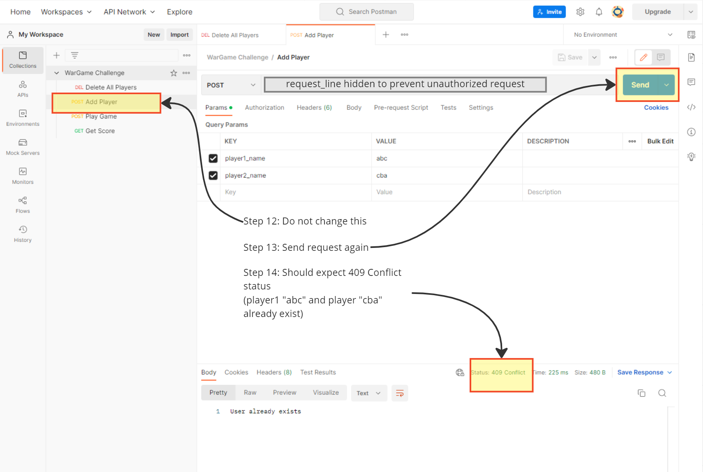

# WarGame
RESTful service of War Game

## Introduction

This is the submission of WarGame coding challenge by Peiyu (Steve) Hu. 

### High Level

* Creates a RESTful service with four endpoints:
  
  * An endpoint to initiate the game. Adding two simulated players to DB.
	* An endpoint to start a game. Two simulated players will play out the game.
	* An endpoint to get lifetime wins for each player stored in a database.
	* An endpoint to delete all entries of players and scores in the database.

* Please refer to Postman Colleciton for tests.

### Technical

* The service is created by Java and Spring Boot.
* The service is deployed on GCP.
* The service used MySQL DB deployed on AWS RDS. For credentials, please contact jiapodou@gmail.com.

Bonuses for providing:

* The Docker link to a cloud deployment of the service is provided in Postman Colleciton.

## Submission
* Please refer to the instructions below on how to run this application. 

## Important

  * **In order to prevent unauthorized requests which incur additional costs on GCP and AWS, the link to Postman Collection is not listed here.**
  * **Please refer to the submission email for the Postman Collection link**

## Instructions

 1. Download Postman or run the web version on https://www.postman.com/downloads/
 2. Register with an email 
 3. IMPORTANT: refer to the submission email for the Postman Collection link
 4. Import Postman Collection link(shown below)
 

 5. Import Postman Collection link(shown below)

 6. Import Postman Collection link(shown below)

 7. Sheck import of Postman Collection link(shown below)

 8. Send Detele All Player request(shown below)

 9. Send Add Player request(shown below)

 10. Send Add Player request with bad input(shown below)

 11. Send Play Game request(shown below)

 12. Send Get Score request on player(shown below)

 13. Send Get Score request on another player(shown below)

 14. Play more games and get score(shown below)

 15. Send Get Score request with bad input(shown below)

 16. EXTRA STEPS: Add more players(shown below)

 17. EXTRA STEPS: Play more games(shown below)

 17. EXTRA STEPS: Check scores of other players(shown below)

## To-dos

* It would be great to include the endpoint querying players scores against a specific opponent.
* It would be great to include the endpoint saving players result of each game.
* It would be great to include the endpoint simulate the game round by round instead of the entire game.
* The current game ends after 1,000 rounds of battle in order to determine a winner, it would be great to study the rules of War Game with modifications so that the game ends with less rounds.
